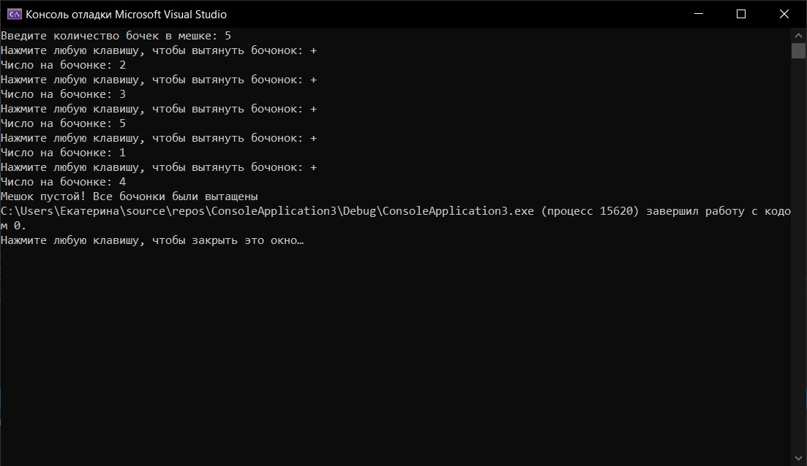

# practica4
1. Я написала на языке С++ программу для проведения жеребьевки методом генерации случайных чисел. 
2. При успешном запуске высветится консоль, в которую будет необходимо ввести: натуральное число (количество бочек в мешке). Затем необходимо нажать любую клавишу для того, чтобы    вытянуть боченок. Программа выводит на экран рандомное число на боченке, которое вам выпало. Эта процедура повторяется пока боченки в мешке не кончатся и промграмма не выведет    надпись об этом. На этом программа завершает свою работу.

   Вот листинг теста программы:
   
   
   
3. Необходимо открыть файл программы ConsoleApplication6.cpp. Её запуск  осуществляется в среде разработки, в нашем случае в Visual Studio. Его можно осуществить с помощью горячих    клавиш ctrl+F5 или с помощью меню: выбрать в строке    меню Сборка -> пункт Собрать решение, Отладка -> пункт Запуск без отладки.
